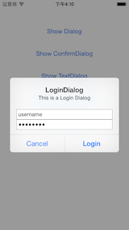
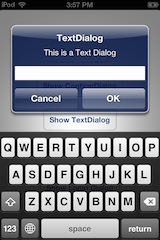
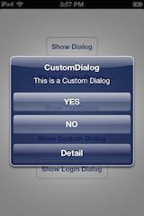
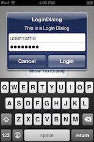

FISAlertManager
===============

An alert utility for ios to show alert easier and no need to consider compatibility problems (compatible with ios5/6/7/8)

##Install
Add FISAlertManager folder to your project.

##Init
Init FISAlertManager like os:

    [FISAlertManager sharedManager].viewController=self;

also you can set OK and Cancel button title:

    [FISAlertManager sharedManager].titleOK=NSLocalizedString(@"OK", nil);
    [FISAlertManager sharedManager].titleCancel=NSLocalizedString(@"Cancel", nil);

##Usage
Show a simple alert in just one line:

    [[FISAlertManager sharedManager] showAlert:@"Dialog" 
                                      message:@"This is a Dialog" 
                                      handler:^(id alert){}];

Show a confirm alert in one line:

    [[FISAlertManager sharedManager] showConfirmDialog:@"ConfirmDialog" 
                                              message:@"This is a Confirm Dialog" 
                                              handler:^(id alert){}];

Show an input alert in one line:

    [[FISAlertManager sharedManager] showTextAlert:@"TextDialog" 
                                          message:@"This is a Text Dialog" 
                                          handler:^(id alert){}];

Show a custom alert:

    NSMutableArray *items=[NSMutableArray array];
    [items addObject:[FISItem itemWithTitle:@"YES" handler:nil]];
    [items addObject:[FISItem itemWithTitle:@"NO" handler:nil]];
    [items addObject:[FISItem itemWithTitle:@"Detail" handler:nil]];
    [[FISAlertManager sharedManager] showAlert:@"CustomDialog" message:@"This is a Custom Dialog" items:items];

Show a login alert:

    NSMutableArray *items=[NSMutableArray array];
    [items addObject:[FISItem itemWithTitle:@"Cancel" handler:nil]];
    [items addObject:[FISItem itemWithTitle:@"Login" handler:nil]];
    [items addObject:[FISItem itemWithTitle:@"username" placeholder:@"username" security:NO]];
    [items addObject:[FISItem itemWithTitle:@"password" placeholder:@"password" security:YES]];
    [[FISAlertManager sharedManager] showAlert:@"LoginDialog" message:@"This is a Login Dialog" items:items];

##Some Screenshots

